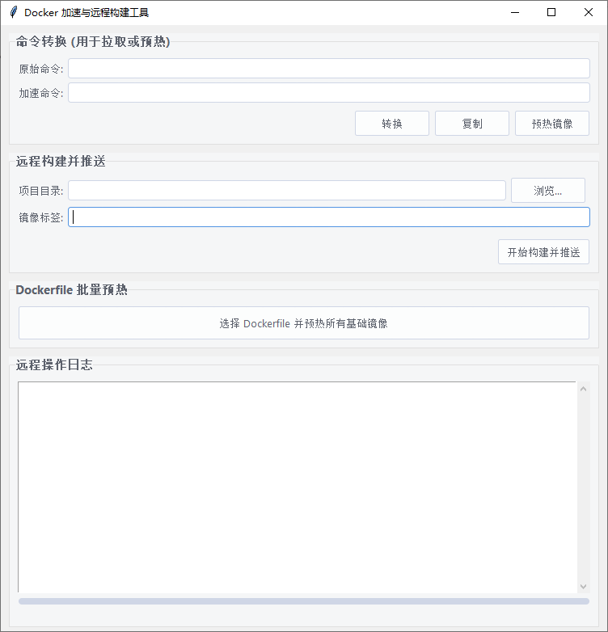

# Docker 加速与远程构建工具

这是一个桌面应用程序，旨在解决在中国大陆等网络环境下使用 Docker 时遇到的各种速度慢的问题。它通过 SSH 连接到您的海外 VPS，利用其高速网络作为“云端操作台”，实现镜像加速、远程预热和远程构建功能。

最新的版本采用了**双仓库架构**，将**私有镜像存储**和**公共镜像加速缓存**彻底分离，提供了更专业、更稳定的解决方案。

注意：本项目基于自有VPS搭建Docker反向代理和私有仓库，如果你没有海外VPS或不想搭建，请看[这篇文章](https://github.com/ccxkai233/Image-GithubPushAliyun)

关于搭建反代Docker与私有仓库，请看[这篇文章](dos\Docker-reverse-proxy-using-Caddy.md)

> **说人话：**
>
> 我真是被Docker网络折磨的受不了了，我的代理明明可以跑满500MBPS，但在拉取和构建镜像的时候却慢的要死，快了能有1-2MB/S 慢的就只有100kb/s左右了。
>
> 因此我部署了反代Docker和私有仓库,并制作了这个脚本，它有以下功能。



## 一、命令转换 (用于拉取或预热)

> ~~真是邪门~~，我在两台电脑，三台VPS上更改daemon.json为我的反代域名都无法发挥作用，还是死犟的默认从官方站拉取。~~gemini直呼灵异事件~~

- **命令转换**: 于是只好使用一次性镜像加速命令，脚本的这个功能就是做命令转换。好处可能是不用每台机器都单独配置了？
- **预热按钮**: 在第一次拉取之前，提前在VPS上拉取一次，建立缓存，这样本地再拉取就已经是缓存好了的。

## 二、远程构建并推送 (开发时可能比较实用)

- 这是利用vps的远程私有仓库，将代码打包上传到VPS上构建，利用VPS的高速网络快速构建，然后推送给私有仓库。
- 选择项目Dockerfile所在的文件夹即可，点击。
- 接着自动生成高速拉取的指令，复制执行即可，非常方便。

## 三、Dockerfile 批量预热（我是用不到这个功能，我下载别的依赖一样很慢，但万一有人能用到呢？）

- 如果想在本地构建的话，可以先用这个批量预热以下源镜像。
选择你的Dockflie文件即可，会自动预热基础镜像，并根据你的dockerfile生成一个管道命令。
- 注意：这无法解决构建时依赖下载缓慢的问题，除非改用国内源，否则还是推荐使用云端构建的方案。

---

## ✨ 功能特性

- **命令转换**：快速将标准的 `docker pull` 或 `Dockerfile` 中的 `FROM` 指令转换为使用您的**缓存仓库 (`mir.`)** 地址，实现拉取加速。
- **远程预热**：通过您的**缓存仓库 (`mir.`)**，在 VPS 上高速下载并缓存公共镜像，以便后续使用。支持单个或从 `Dockerfile` 批量预热。
- **远程构建并推送**：
    - 选择一个本地项目文件夹（需包含 `Dockerfile`）。
    - 工具会自动将项目打包上传到您的 VPS，在 VPS 上执行 `docker build`。
    - 构建好的镜像会被推送到您的**私有仓库 (`dcr.`)**。
    - 全程自动化，是轻量级的 CI/CD 触发器。
- **图形用户界面 (GUI)**：所有功能都集成在一个简洁明了的图形界面中，操作直观。
- **安全连接**：支持通过 SSH 密钥进行连接，保证了操作的安全性。

## 🚀 快速开始

### 前置条件

1.  **一台海外 VPS**：拥有良好的国际网络连接，并已安装好 Docker 和 Docker Compose。
2.  **一个主域名** (例如 `example.com`)：用于设置两个子域名。
3.  **在VPS上运行代理服务**：理论上讲这不需要，但经过我实测，如果不用本机自带的代理连接，速度和直接通过docker官网拉取是一样的 ~~真邪门啊~~
4.  **云端双仓库服务**：您需要在 VPS 上搭建好我们推荐的双实例仓库服务。详细的搭建教程请参考 `INFRASTRUCTURE.md` 文件。
5.  **Python 环境**：在您的本地电脑上安装 Python 3.x。

### 安装与配置

1.  **克隆或下载项目**到您的本地电脑。

2.  **安装依赖**
    ```bash
    pip install -r requirements.txt
    ```

3.  **创建并编辑配置文件**
    - 将 `config.ini.example` 文件复制一份，并重命名为 `config.ini`。
    - 打开 `config.ini` 文件，根据注释，填写您自己的信息：
        - `private_registry`: 您的**私有仓库**域名 (例如 `dcr.example.com`)。
        - `cache_registry`: 您的**缓存仓库**域名 (例如 `mir.example.com`)。
        - `registry_user` / `registry_pass`: 您私有仓库的用户名和密码。
        - `SSH` 部分：您 VPS 的 IP 地址、SSH 端口、用户名以及私钥文件的完整路径。

4.  **登录到您的私有仓库**
    - 在您**自己的电脑**上打开终端，执行以下命令，并按提示输入您设置的用户名和密码：
        ```bash
        docker login dcr.your-domain.com
        ```
        *(请将域名替换为您自己的私有仓库域名)*
    - **注意**：这一步只需执行一次。登录成功后，Docker 会保存您的凭证。

### 运行程序

完成以上步骤后，执行以下命令即可启动应用程序：

```bash
# 在 Windows 上
start.bat

# 在 macOS / Linux 上
python app.py
```

## 📖 使用指南

### 场景一：加速拉取单个公共镜像

1.  在“原始命令”框中输入标准的拉取命令，例如 `docker pull nginx:alpine`。
2.  点击“**转换**”按钮，“加速命令”框会生成指向您缓存仓库的命令。
3.  **（可选）** 点击“**预热镜像**”按钮，会先在您的 VPS 上高速下载并缓存该镜像。日志区会显示预热过程。
4.  在您自己电脑的终端中执行“加速命令”框里的命令，享受高速下载。

### 场景二：加速本地 Dockerfile 构建

这是解决 `Dockerfile` 中 `FROM` 指令下载缓慢问题的最佳实践。

1.  点击“**选择 Dockerfile 并预热所有基础镜像**”按钮，在弹出的窗口中选择您本地的 `Dockerfile`。
2.  程序会自动解析文件，并在您的 VPS 上高速预热所有 `FROM` 指令中定义的基础镜像。
3.  **关键步骤**：预热成功后，“加速命令”框中会自动生成一条**可以直接运行的、管道模式的 `docker build` 命令**。
4.  **复制这条长命令**，在您本地的项目根目录终端中直接粘贴并执行。
5.  您的本地 `docker build` 过程会因为基础镜像已缓存而变得飞快。

### 场景三：远程构建并推送私有镜像（推荐）

当您不想在本地构建，或者需要一个简单的 CI/CD 流程时，使用此功能。

1.  在“远程构建并推送”功能区，点击“**浏览...**”按钮，选择您本地包含 `Dockerfile` 的项目文件夹。
2.  在“**镜像标签**”输入框中，为您的项目指定一个名称和标签（例如 `my-web-app:1.0`）。程序会自动记住您上次成功使用的标签。
3.  点击“**开始构建并推送**”按钮。
4.  程序会自动完成：打包 -> 上传 -> 远程构建 -> 推送到您的**私有仓库 (`dcr.`)** -> 清理 的所有步骤。
5.  成功后，用于从私有仓库拉取该镜像的 `docker pull` 命令会自动生成在“加速命令”框中。

## 🛠️ 架构与项目结构

本项目的核心是云端的双仓库架构，详细说明请参考 `INFRASTRUCTURE.md`。

**项目文件结构:**
```
.
├── .gitignore
├── LICENSE
├── app.py              # 主程序入口
├── config.ini          # 私有配置文件 (不上传)
├── config.ini.example  # 配置文件模板
├── INFRASTRUCTURE.md   # 云端架构说明
├── README.md           # 本文件
├── requirements.txt    # Python 依赖列表
└── src/                # 源代码目录
    ├── config.py           # 配置加载模块
    ├── docker_helpers.py   # Docker 命令处理模块
```

---
*这个项目是在一次次 ~~有趣~~ **折磨** 的探索和调试过程中诞生的，希望能帮助到更多的人。*
## 📜 开源协议

本项目基于 **MIT 许可证** 开源。详情请参阅 `LICENSE` 文件。